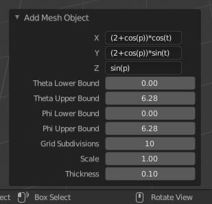
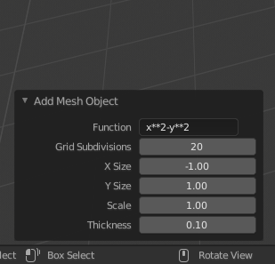
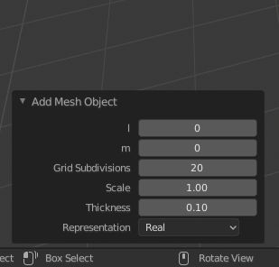

# Blender Addon

  
  
  

This is an addon design to create 3d meshes within blender 2.8. It can create different complex mathematical shapes that span a wide variety of mathematical functions. The main purpose of this addon is 3d printing for this reason a subsurf modifier is set to get a high level of detail as well as a solidify modifier this makes the meshes editable in a non destructive manner. The addon also work as a modeling tool since low poly primitives can be created and modified to achieve particular curves and shapes. Also 2d shapes can be created and then extruded to get all sort of high detail models that work perfectly with subdivision techniques. Finally, with the power of blender this addon is also great for visualization purposes even for use in the academia due to its GPL licence. 

To install this module properly scipy need to be install in the blender python environment. This can easily be done as follows in linux based systems however is analogous for windows and mac:

`cd /path/to/blender/python/bin`
`./python -m ensurepip`
`./python -m pip install scipy`

## XYZ
The addon gives the capability of creating XYZ parametric plots.

  
  

## Z-Functions
The addon gives the capability of creating a z function based on a 2d grid.

  
  

## Atomic Orbitals
The addon gives the capability of creating spherical harmonics.

  
  

